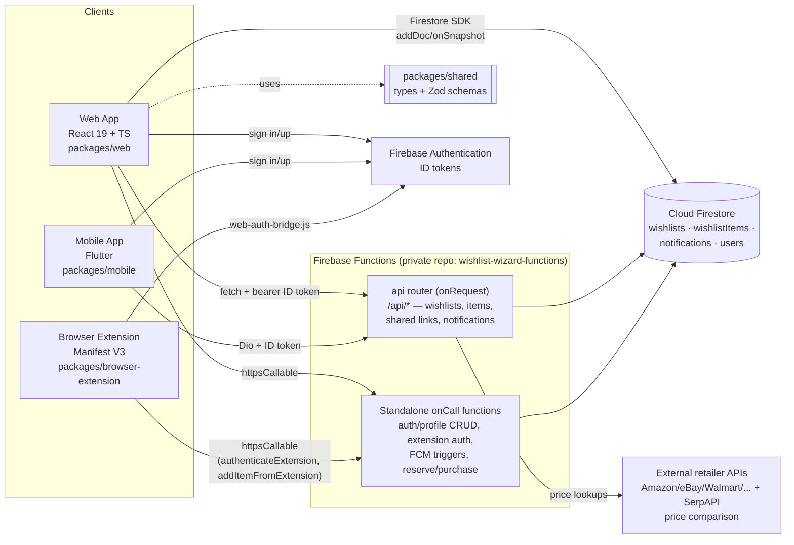

# Wishlist Wizard - Wishlist Management Platform

[](https://github.com/NelsonGrey/wishlist-wizard/actions/workflows/master-pipeline.yml) [](https://github.com/NelsonGrey/wishlist-wizard/blob/develop/LICENSE)

## Contents

- [Demo](#demo)
  - [Architecture](#architecture)
  - [Walkthrough: creating, sharing, and claiming a wishlist item](#walkthrough-creating-sharing-and-claiming-a-wishlist-item)
- [Key Features](#key-features)
  - [Core Functionality](#core-functionality)
  - [Advanced Features](#advanced-features)
  - [Browser Extension](#browser-extension)
  - [E-Commerce Integration](#e-commerce-integration)
- [Getting Started](#getting-started)
  - [Development Setup](#development-setup)
  - [Account Creation](#account-creation)
  - [Creating Your First Wishlist](#creating-your-first-wishlist)
  - [Adding Beneficiaries](#adding-beneficiaries)
  - [Browser Extension Installation](#browser-extension-installation)
- [Advanced Usage](#advanced-usage)
  - [Calendar Integration](#calendar-integration)
  - [Collaborative Wishlists](#collaborative-wishlists)
  - [E-Commerce Platform Integration](#e-commerce-platform-integration)
- [Technical Details](#technical-details)
  - [Architecture](#architecture)
  - [System Requirements](#system-requirements)
  - [Environment Setup](#environment-setup)
  - [API Integration](#api-integration)
  - [Firebase Integration (Primary Infrastructure)](#firebase-integration-primary-infrastructure)
- [Zero-Touch DevOps Automation](#zero-touch-devops-automation)
  - [Automation Features](#automation-features)
  - [Quick Automation Start](#quick-automation-start)
  - [Automated CI/CD Pipeline](#automated-cicd-pipeline)
  - [Security Features](#security-features)
- [Automated Deployment](#automated-deployment)
  - [Deployment Targets](#deployment-targets)
  - [Automated Pipeline](#automated-pipeline)
  - [Manual Deployment](#manual-deployment)
  - [Data Privacy](#data-privacy)
- [Getting Help](#getting-help)
- [Upcoming Features](#upcoming-features)

Wishlist Wizard is a comprehensive wishlist management platform that empowers users to create, share, and collaborate on wishlists with advanced social and tracking capabilities. It offers a seamless experience across web, mobile, and browser extension platforms.

## Demo

### Architecture

Three thin clients (web, mobile, browser extension) share one Firebase backend. Business logic lives in a private companion repo, `wishlist-wizard-functions`; the diagram below shows the client-side architecture and the API boundary this repo actually calls (`docs/SYSTEM_ARCHITECTURE.md`).



### Walkthrough: creating, sharing, and claiming a wishlist item

1. **Create a wishlist.** The web dashboard calls `FirebaseWishlistService.createWishlist()` (`packages/web/client-src/lib/firebase-service.ts:173`), which writes an `addDoc` directly to the `wishlists` Firestore collection with the fields on the `Wishlist` interface (`id, userId, name, isPublic, isCollaborative, shareId, occasion, ...`), defined at `firebase-service.ts:45`.
2. **Add an item.** `FirebaseWishlistService.addWishlistItem()` (`firebase-service.ts:280`) adds a doc to `wishlistItems`, typed by the `WishlistItem` interface (`title, price, productUrl, store, priority, reservedByUserId, purchasedByUserId`, `firebase-service.ts:68`).
3. **Share it.** Every wishlist carries a `shareId`. A recipient opens `/shared/:shareId`, which `SharedWishlist.tsx` (`packages/web/client-src/pages/SharedWishlist.tsx:108-123`) resolves by calling `GET /api/shared/${shareId}` through the Firebase Functions `api` router, returning a `SharedWishlistResponse { wishlist, items }` (typed at `SharedWishlist.tsx:15-44`).
4. **A collaborator reserves the item.** From `WishlistDetail.tsx`, `reserveItemMutation` (`packages/web/client-src/pages/WishlistDetail.tsx:601`) calls `FirebaseWishlistService.reserveItem(itemId, userId)`, which does `apiRequest('/api/items/${itemId}/reserve', { method: 'POST', body: { userId }, useFirebaseFunctions: true })` (`firebase-service.ts:329-335`) — a callable, not a raw Firestore write, so the gift-giver never sees the reservation. The UI then reads `item.reservedByUserId` to flip the item's status badge to "Reserved" (`WishlistDetail.tsx:372-375`), and a `collaboration_invite`/`item_reserved`-style notification is emitted per the shared types in `packages/shared/src/collaboration.ts`.

Everything past step 3 (the router/callable handlers themselves, Firestore rules enforcement, price-tracking jobs) lives in the private `wishlist-wizard-functions` repo — not reproducible here, but the request shapes above are read directly from this repo's client code, not invented.

## Key Features

### Core Functionality
- **Wishlist Creation & Management**: Create and organize multiple wishlists for different occasions and beneficiaries.
- **Multi-Beneficiary Support**: Manage wishlists for yourself and others (children, partners, friends, etc.).
- **Item Management**: Add, edit, remove, and prioritize items in your wishlists.
- **Social Sharing**: Share wishlists with friends and family via direct links or social media.

### Advanced Features
- **Collaborative Wishlists**: Co-create and edit wishlists with friends and family for group gifting.
- **Calendar Integration**: Sync birthdays, holidays, and other occasions with Google Calendar, Outlook, or Apple Calendar.
- **Social Network & Discovery**: Find trusted profiles and coordinate shared planning.
- **Cross-Platform Access**: Use WishKeeper on web, mobile, and through a browser extension.
- **Notification System**: Receive alerts for approaching events or collaborative activities.

### Browser Extension
- **One-Click Adding**: Add items to your wishlists while browsing online stores.
- **Price Comparison**: Compare prices across different retailers.
- **Automatic Product Detection**: Automatically detects product information on supported websites.

### E-Commerce Integration
- **Multi-Platform Support**: Integration with Amazon, eBay, Etsy, Walmart, Target, and Best Buy.
- **Product Data Extraction**: Extract detailed product information from URLs.
- **Price Tracking & Affiliate Monetization**: Live — price drop/volatility tracking, plus a full commission
  ledger, Stripe Connect creator payouts, and a tier-gated creator dashboard (`/app/creator-dashboard`),
  shipped 2026-07-21.

## Getting Started

### Development Setup

This project consists of:
- **Web App**: React frontend with TypeScript (`packages/web/`)
- **Backend**: Firebase Functions, serverless (`packages/functions/`) — the live API; root `server/`/`client/` and `packages/api-server` are historical and not deployed. Real backend source now lives in a private companion repo (`NelsonGrey/wishlist-wizard-functions`, extracted 2026-07-17); `packages/functions/` is gitignored here and must be cloned separately for local dev/emulator use.
- **Mobile App**: Flutter app for iOS and Android (`packages/mobile/`)
- **Browser Extension**: Chrome/Firefox extension (`packages/browser-extension/`)
- **Shared Libraries**: Common TypeScript code (`packages/shared/`)

#### Prerequisites
- Node.js v18+ 
- npm or yarn
- Flutter SDK 3.8+
- Xcode (for iOS development)
- Android Studio (for Android development)

#### Quick Start
```bash
# Install dependencies
npm install

# Start development server (serves both frontend and API)
npm run dev

# Build for production
npm run build

# Start production server
npm run start
```

#### Synthetic Test Users + Functionality Smoke Test
```bash
# Runs Firebase emulators (auth/firestore/functions), seeds synthetic users,
# and exercises callable wishlist flows (create/update/item CRUD/delete)
npm run test:users:smoke

# If emulators are already running, run only the smoke script
npm run test:users:smoke:live
```

Smoke report output:
- JSON artifact: `artifacts/smoke-users-report.json`
- Includes per-callable pass/fail, HTTP status, duration, and run summary

#### Full Functions Contract Smoke Test
```bash
# Strict mode: preserves environment/config warnings (FCM/Stripe gaps remain warned)
npm run test:functions:smoke:all:strict

# Env-aware mode: treats known dependency/config gaps as expected passes
npm run test:functions:smoke:all:env-aware
```

Notes:
- `test:functions:smoke:all` is the strict baseline and is equivalent to `test:functions:smoke:all:strict`.
- Env-aware mode sets `SMOKE_TREAT_EXPECTED_DEPENDENCY_GAPS_AS_PASS=true` for the emulator run.
- Full report artifact: `artifacts/smoke-all-functions-report.json`.
- In env-aware mode, report metadata includes `treatExpectedDependencyGapsAsPass: true`.

Latest comparison snapshot:

| Mode | Total | Passed | Warned | Failed | Warning scope |
| --- | ---: | ---: | ---: | ---: | --- |
| Strict | 273 | 265 | 8 | 0 | FCM topic/test notification callables (3), Stripe group-gifting callables (2), Stripe HTTP endpoints (2), upstream barcode provider callable dependency (1) |
| Env-aware | 273 | 273 | 0 | 0 | Same 8 expected dependency gaps are treated as pass |

#### Flutter Mobile App
```bash
# Navigate to mobile directory
cd packages/mobile

# Install Flutter dependencies
flutter pub get

# Run on iOS simulator
flutter run -d ios

# Run on Android emulator
flutter run -d android

# Build for release
flutter build ios --release
flutter build apk --release
```

### Account Creation
1. Visit the Wishlist Wizard website
2. Click "Sign Up" in the top-right corner  
3. Fill in your details and create an account
4. Verify your email address

### Creating Your First Wishlist
1. Click "Create Wishlist" on your dashboard
2. Name your wishlist and set an occasion (optional)
3. Add items by clicking "Add Item"
4. For each item, you can add:
   - Name
   - Description
   - Price
   - Link
   - Priority
   - Image (optional)

### Adding Beneficiaries
1. Navigate to "Beneficiaries" in the sidebar
2. Click "Add Beneficiary"
3. Fill in their details including:
   - Name
   - Relationship
   - Birthday (optional)
   - Preferences (optional)

### Browser Extension Installation
1. Visit your browser's extension store
2. Search for "Wishlist Wizard"
3. Click "Add to Browser"
4. Sign in with your Wishlist Wizard account

## Advanced Usage

### Calendar Integration
1. Navigate to "Calendar" in the sidebar
2. Click on the "Connections" tab
3. Select which calendar service you want to connect (Google, Outlook, Apple)
4. Follow the authentication steps
5. Choose which events to sync (birthdays, wishlist deadlines, etc.)
6. Your Wishlist Wizard events will now appear in your external calendar

### Collaborative Wishlists
1. Open an existing wishlist or create a new one
2. Click "Collaborators" at the top-right
3. Enter the email addresses of people you want to invite
4. Select their permission level (view, edit, admin)
5. They'll receive an invitation to collaborate

### E-Commerce Platform Integration
1. Navigate to "Settings" > "E-Commerce"
2. Select the platforms you want to enable
3. The system will now fetch product data from these platforms
4. Product metadata and links are normalized for consistent wishlist management

## Technical Details

### Architecture
- **Frontend**: React 19 + TypeScript + Vite
- **Backend**: Firebase Functions (TypeScript) + Firestore — the Express.js/PostgreSQL server this project started with was removed in the Firebase-first migration; `packages/api-server` and root `server/`/`client/` are historical and no longer contain live source
- **Mobile**: Flutter 3.8+ with Provider state management
- **Styling**: Tailwind CSS (web), Material Design (mobile)

### System Requirements
- **Browser Support**: Chrome, Firefox, Safari, Edge (latest versions)
- **Mobile Support**: iOS 16+ and Android 8.0+ (Flutter app)
- **Internet Connection**: Required for collaboration and calendar syncing

### Environment Setup
Required environment variables (add to `.env`) — see the Firebase Integration section below for the full `VITE_FIREBASE_*` set:
```env
VITE_GA_MEASUREMENT_ID=G-...
```
Note: `OPENAI_API_KEY` and `SENDGRID_API_KEY` are **not required** — neither service is used anywhere in this codebase. Recommendations are Firestore-backed, not model-backed, and transactional email uses Workspace SMTP via Nodemailer.

### API Integration
Wishlist Wizard integrates with the following external APIs:
- **E-commerce APIs**: Amazon, eBay, Etsy, Walmart, Target, Best Buy
- **SerpAPI**: For multi-retailer price comparison
- **Calendar APIs**: Google Calendar, Microsoft Outlook, Apple Calendar
- **Payment Processing**: For group gifting contributions
- **Social Media**: For advanced sharing capabilities
- **Firebase**: Primary infrastructure — Auth, Firestore, Functions, Hosting, Cloud Messaging, Analytics (not optional — see below)

### Firebase Integration (Primary Infrastructure)
**Wishlist Wizard leverages Firebase as the primary infrastructure platform** for authentication, data storage, serverless functions, hosting, and analytics.

#### Required Firebase Setup:
1. **Firebase Project Configuration**: Already configured with project ID `wishlist-wizard`
```dotenv
VITE_FIREBASE_API_KEY=your-firebase-web-api-key
VITE_FIREBASE_AUTH_DOMAIN=your-project.firebaseapp.com
VITE_FIREBASE_PROJECT_ID=your-project-id
VITE_FIREBASE_STORAGE_BUCKET=your-project.firebasestorage.app
VITE_FIREBASE_MESSAGING_SENDER_ID=your-messaging-sender-id
VITE_FIREBASE_APP_ID=your-web-app-id
VITE_FIREBASE_MEASUREMENT_ID=your-measurement-id
VITE_FIREBASE_AUTO_INIT=false
```

2. **Firebase Services Enabled**:
   - ✅ **Firestore Database**: Primary data storage with security rules
   - ✅ **Firebase Functions**: Serverless API and background operations  
   - ✅ **Firebase Hosting**: Web app deployment with CDN
   - ✅ **Firebase Authentication**: User management — live, used by both the web app and the browser extension
   - ✅ **Cloud Messaging**: Push notifications
   - ✅ **Firebase Analytics**: User behavior tracking
   - ✅ **Firebase Storage**: Media and file uploads
   - ✅ **Cloud Scheduler**: Scheduled background workflows

3. **Development with Firebase Emulators**:
```bash
npx firebase emulators:start --project wishlist-wizard --only auth,firestore,functions
npx firebase deploy --project wishlist-wizard
```

4. **Firebase-Native Features**:
   - **Scheduled Processing**: Implemented as Firebase Functions with Cloud Scheduler
   - **Real-time Updates**: Firestore real-time subscriptions
   - **Push Notifications**: FCM for web and mobile
   - **Serverless Architecture**: Firebase Functions v2 for all API operations
   - **Secure Authentication**: Firebase Auth with custom claims

See `FIREBASE_STRATEGY.md` for comprehensive Firebase integration details.

## Zero-Touch DevOps Automation

Wishlist Wizard includes a complete **zero-touch DevOps automation suite** that eliminates manual credential management and provides automated CI/CD, monitoring, and deployment capabilities.

### Automation Features
- **Automated Token Management**: GitHub, Firebase, Docker registry, and API tokens rotate automatically
- **Multi-Environment Management**: Development, staging, and production environments with isolated secrets
- **Intelligent Monitoring**: 24/7 health checks with auto-healing and smart alerting
- **Zero-Touch Deployments**: Push to `main`/`staging` → automatic deployment via `master-pipeline.yml` (web, iOS/Android builds, functions), gated by environment and the quality-gate job; Chrome extension publish and full iOS App Store submission remain manual (`workflow_dispatch`)
- **Self-Healing Systems**: Automatic service restarts, certificate renewal, and issue resolution
- **Multi-Channel Alerts**: Email, Slack, and log-based notifications
- **Automated Backups**: Daily backups with disaster recovery capabilities

### Quick Automation Start
```bash
# Complete automated setup
./automate.sh setup

# Start 24/7 monitoring with auto-healing
./automate.sh monitor start

# Deploy everything automatically
./automate.sh deploy full production

# Rotate all tokens automatically
./automate.sh tokens rotate
```

### Automated CI/CD Pipeline
- **Quality Checks**: TypeScript compilation, tests, security audit
- **Multi-Platform Builds**: Web, API, mobile, and extension builds
- **Automated Deployment**: Push to `main` triggers full deployment
- **Artifact Management**: Build artifacts stored for rollback capability

### Security Features
- **Automated Token Rotation**: GitHub, Firebase, API secrets rotate automatically
- **Environment Isolation**: Secrets isolated per environment
- **GitHub Secrets Sync**: Automatic synchronization of secrets
- **Audit Logging**: Comprehensive logging for all operations

See `docs/CICD_SETUP_GUIDE.md` for the current CI/CD pipeline as it actually runs today
(GitHub-hosted runners only). Note: this section describes `automate.sh`, which predates
that pipeline and has not been re-verified against it — treat with caution until confirmed
current.

## Automated Deployment

Wishlist Wizard includes a comprehensive CI/CD pipeline that automatically builds, tests, and deploys all components:

### Deployment Targets
- **🌐 Web App**: Firebase Hosting (`https://wishlist-wizard.web.app`)
- **🚂 API Server**: Firebase Functions (`https://api.wishlist-wizard.web.app`)
- **📱 Mobile PWA**: Firebase Hosting (`https://wishlist-wizard.web.app`)
- **🔌 Chrome Extension**: Chrome Web Store (manual submission)

### Automated Pipeline
- **Quality Checks**: TypeScript compilation, tests, security audit
- **Multi-Platform Builds**: Web, API, mobile, and extension builds
- **Automated Deployment**: Push to `main` triggers full deployment
- **Artifact Management**: Build artifacts stored for rollback capability

### Manual Deployment
```bash
# Deploy all components
npm run deploy

# Deploy individual components  
npm run deploy:web     # Deploy to Firebase Hosting
npm run deploy:api     # Deploy to Firebase Functions
npm run deploy:mobile  # Deploy to Firebase Hosting

# Create extension package
npm run package:extension
```

See `AUTOMATED_DEPLOYMENT.md` for complete setup and configuration details.

### Data Privacy
- All personal data is encrypted and stored securely
- Wishlists can be set to private, shared with specific people, or public
- You can delete your account and all associated data at any time

## Getting Help

- **Support**: Email support@wishlist-wizard.com
- **Documentation**: https://docs.wishlistwizard.com
- **FAQ**: Available in the Help section of the app

## Upcoming Features

- AI recommendations
- Group gifting payments
- Advanced creator monetization dashboards beyond v1 (deeper analytics, more payout networks)
- Phase 3 ecosystem expansion (AR, white-label, conversational AI)
- Extended mobile and collaboration enhancements

---

© 2026 Wishlist Wizard, a product of Nelson Grey. All rights reserved.
